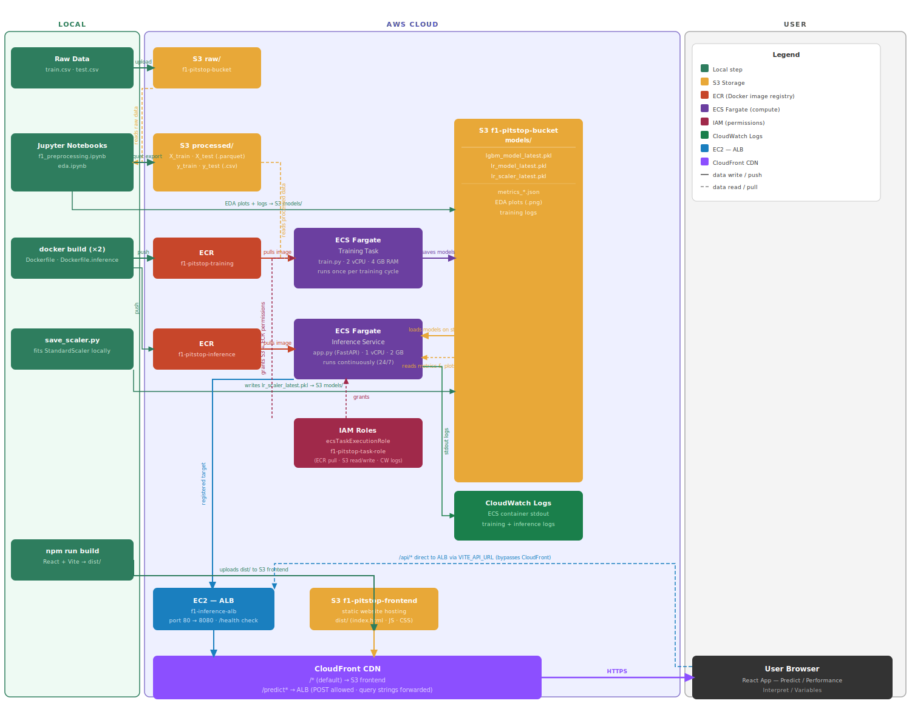

# F1 Pit Stop Prediction — AWS ML Pipeline

Predicts whether a Formula 1 car should pit on the next lap, using race telemetry data and two machine learning models (LightGBM and Logistic Regression) deployed as a REST API on AWS ECS Fargate, served through a React web application via CloudFront.

This project is based on the Kaggle competition:

- [Playground Series S6E5 — Predict Pit Stops](https://www.kaggle.com/competitions/playground-series-s6e5)
- Our AWS [frontend](https://d3vlnh9r716hv1.cloudfront.net/) 

in order to demonstrate my AWS knowledge.

## Table of Contents

1. [Architecture Overview](#architecture-overview)
2. [Dataset](#dataset)
3. [Project Structure](#project-structure)
4. [AWS Services Used](#aws-services-used)
5. [Step-by-Step Setup](#step-by-step-setup)
   - [Step 1 — S3 Bucket Setup](#step-1--s3-bucket-setup)
   - [Step 2 — Data Upload](#step-2--data-upload)
   - [Step 3 — Data Preprocessing](#step-3--data-preprocessing)
   - [Step 4 — Model Training on ECS](#step-4--model-training-on-ecs)
   - [Step 5 — Save the Scaler](#step-5--save-the-scaler)
   - [Step 6 — Inference Service on ECS + ALB](#step-6--inference-service-on-ecs--alb)
   - [Step 7 — Frontend Deployment (S3 + CloudFront)](#step-7--frontend-deployment-s3--cloudfront)
6. [Models](#models)
7. [API Reference](#api-reference)
8. [Configuration](#configuration)
9. [Environment Variables](#environment-variables)
10. [Quick Local Testing](#quick-local-testing-no-aws-deployment-required)
11. [Security Notes](#security-notes)

---

## Architecture Overview

```
Raw Data (local)
      │
      ▼
S3 Bucket (raw/)
      │
      ▼  [f1_preprocessing.ipynb — run locally]
S3 Bucket (processed/)   ←──── EDA (eda.ipynb)
      │
      ├──────────────────────────────────────┐
      ▼                                      ▼
ECS Fargate (Training Task)          save_scaler.py (local)
  Dockerfile + train.py                      │
  Trains LightGBM + LR                       │
      │                                      │
      ▼                                      ▼
S3 Bucket (models/)  ◄─────────────────────┘
  lgbm_model_latest.pkl
  lr_model_latest.pkl
  lr_scaler_latest.pkl
      │
      ▼
ECS Fargate (Inference Service)
  Dockerfile.inference + app.py (FastAPI)
  Loads models + scaler from S3 on startup
      │
      ▼
Application Load Balancer (ALB)
      │
      ▼
CloudFront Distribution
  ├── Default origin → S3 (React frontend)
  └── /predict* path → ALB (API)
      │
      ▼
React + Vite Frontend (browser)
```


---

## Dataset

- **Source:** [Kaggle Playground Series S6E5](https://www.kaggle.com/competitions/playground-series-s6e5) — F1 pit stop prediction dataset
- **Raw files:** `train.csv`, `test.csv` (stored in S3 `raw/` prefix, not committed to Git)
- **Target column:** `PitNextLap` (binary — 1 = pit on next lap, 0 = stay out)
- **Class imbalance:** ~10% positive class (pit events are rare)

---

## Project Structure

```
.
├── f1_preprocessing.ipynb      # Data cleaning, feature engineering, export to S3
├── eda.ipynb                   # Exploratory data analysis and visualisation
├── train.py                    # Model training script (runs inside ECS container)
├── save_scaler.py              # Fits StandardScaler and saves it to S3
├── app.py                      # FastAPI inference service
├── test_models.py              # Local model smoke-test
├── Dockerfile                  # Training container image
├── Dockerfile.inference        # Inference container image (lighter, no matplotlib)
├── ecs_task_definition.json    # ECS task definition for training job
├── ecs_inference_task_definition.json  # ECS task definition for inference service
├── cf-new.json                 # CloudFront distribution config (two origins)
├── config.yaml                 # Hyperparameters, S3 paths, logging settings
├── env.example                 # Template for local environment variables
├── requirements.txt            # Python dependencies for training
├── requirements-inference.txt  # Python dependencies for inference
└── frontend/                   # React + Vite web application
    ├── index.html
    ├── package.json
    ├── vite.config.js
    └── src/
        ├── main.jsx
        ├── App.jsx
        ├── api.js
        ├── index.css
        └── components/
            ├── PredictTab.jsx
            ├── PerformanceTab.jsx
            ├── InterpretTab.jsx
            └── VariablesTab.jsx
```

---

## AWS Services Used

| Service | Purpose |
|---|---|
| **S3** | Raw data, processed datasets, trained model artifacts, training logs, frontend static files |
| **ECR** | Docker image registry for training and inference containers |
| **ECS Fargate** | Serverless container execution for model training and inference |
| **ALB** | Load balancer routing HTTP traffic to the inference ECS service |
| **CloudFront** | CDN with two origins: React frontend (S3) and inference API (ALB) |
| **IAM** | Task execution role and task role for ECS containers to access S3 and ECR |
| **CloudWatch Logs** | Captures stdout from ECS containers for monitoring |

---

## Step-by-Step Setup

### Step 1 — S3 Bucket Setup

1. Go to **AWS Console → S3 → Create bucket**
2. Create two buckets in `us-east-1`:
   - `f1-pitstop-bucket` — stores raw data, processed data, model artifacts, logs
   - `f1-pitstop-frontend` — hosts the React static website
3. For `f1-pitstop-frontend`, enable **Static website hosting** under the Properties tab, and set the index document to `index.html`
4. For `f1-pitstop-frontend`, update the Bucket Policy to allow public read access

### Step 2 — Data Upload

1. Download `train.csv` and `test.csv` from [Kaggle Playground Series S6E5](https://www.kaggle.com/competitions/playground-series-s6e5)
2. Go to **S3 → f1-pitstop-bucket → Create folder** and create a folder named `raw`
3. Upload both CSV files into the `raw/` folder

### Step 3 — Data Preprocessing

1. Copy `env.example` to `.env` and fill in your AWS credentials:
   ```
   AWS_ACCESS_KEY_ID=your_key
   AWS_SECRET_ACCESS_KEY=your_secret
   AWS_REGION=us-east-1
   S3_BUCKET=f1-pitstop-bucket
   ```
2. Install dependencies locally:
   ```bash
   pip install -r requirements.txt
   ```
3. Open and run **`f1_preprocessing.ipynb`** top to bottom. This notebook:
   - Loads raw data from S3 `raw/`
   - Cleans the data and engineers 10 features
   - Splits into train/test sets
   - Exports `X_train_lgbm.parquet`, `X_test_lgbm.parquet`, `X_train_lr.parquet`, `X_test_lr.parquet`, `y_train.csv`, `y_test.csv` to S3 `processed/`

4. Open and run **`eda.ipynb`** to generate exploratory visualisations (saved to S3 `models/` for the frontend to display)

### Step 4 — Model Training on ECS

1. **Create an ECR repository** in AWS Console → ECR → Create repository → name it `f1-pitstop-training`

2. **Build and push the training Docker image:**
   ```bash
   aws ecr get-login-password --region us-east-1 | docker login --username AWS --password-stdin <account_id>.dkr.ecr.us-east-1.amazonaws.com
   docker build -t f1-pitstop-training .
   docker tag f1-pitstop-training:latest <account_id>.dkr.ecr.us-east-1.amazonaws.com/f1-pitstop-training:latest
   docker push <account_id>.dkr.ecr.us-east-1.amazonaws.com/f1-pitstop-training:latest
   ```

3. **Register the ECS task definition:**
   - Go to **ECS → Task Definitions → Create new task definition → JSON**
   - Paste the contents of `ecs_task_definition.json` (update `<account_id>` to your AWS account ID)

4. **Create an ECS cluster:**
   - Go to **ECS → Clusters → Create cluster**
   - Name: `f1-pitstop-cluster`, Infrastructure: **AWS Fargate**

5. **Run the training task:**
   - Go to **ECS → Clusters → f1-pitstop-cluster → Tasks → Run new task**
   - Select the `f1-pitstop-training` task definition
   - Fargate, 2 vCPU, 4 GB memory
   - The container reads processed data from S3, trains both models, and saves them to S3 `models/`

6. **Check results in S3:** `f1-pitstop-bucket/models/` should contain `lgbm_model_latest.pkl`, `lr_model_latest.pkl`, and training metrics JSON

### Step 5 — Save the Scaler

The Logistic Regression model requires inputs to be standardised. Run this script locally after training:

```bash
python save_scaler.py
```

This fits a `StandardScaler` on the training data from S3 and uploads `lr_scaler_latest.pkl` to S3 `models/`. This file is required by the inference service at startup.

### Step 6 — Inference Service on ECS + ALB

1. **Create an ECR repository** named `f1-pitstop-inference`

2. **Build and push the inference Docker image:**
   ```bash
   docker build -f Dockerfile.inference -t f1-pitstop-inference .
   docker tag f1-pitstop-inference:latest <account_id>.dkr.ecr.us-east-1.amazonaws.com/f1-pitstop-inference:latest
   docker push <account_id>.dkr.ecr.us-east-1.amazonaws.com/f1-pitstop-inference:latest
   ```

3. **Create an Application Load Balancer:**
   - Go to **EC2 → Load Balancers → Create Load Balancer → Application Load Balancer**
   - Name: `f1-inference-alb`, Scheme: Internet-facing
   - Add a target group on port 8080, health check path: `/health`

4. **Register the inference ECS task definition:**
   - Go to **ECS → Task Definitions → Create new task definition → JSON**
   - Paste the contents of `ecs_inference_task_definition.json` (update `<account_id>`)

5. **Create an ECS service:**
   - Go to **ECS → Clusters → f1-pitstop-cluster → Services → Create**
   - Task definition: `f1-pitstop-inference`, desired count: 1
   - Attach the ALB and target group created above
   - The service runs continuously and auto-restarts on failure

6. **Verify the service:** Visit `http://<alb-dns>/health` — you should see:
   ```json
   {"status": "healthy", "models_loaded": {"lgbm": true, "lr": true}}
   ```

### Step 7 — Frontend Deployment (S3 + CloudFront)

1. **Build the frontend:**
   ```bash
   cd frontend
   npm install
   VITE_API_URL=https://<your-cloudfront-domain> npm run build
   ```

2. **Upload the `dist/` folder** to the `f1-pitstop-frontend` S3 bucket

3. **Create a CloudFront distribution** with two origins:
   - **Origin 1 (default):** `f1-pitstop-frontend.s3-website-us-east-1.amazonaws.com` (HTTP only)
   - **Origin 2:** `<alb-dns>` (HTTP only)
   - **Default cache behaviour:** → Origin 1 (S3 frontend)
   - **Additional behaviour** for path `/predict*`: → Origin 2 (ALB inference), allow all methods, forward query strings
   - Set Default Root Object to `index.html`
   - Custom error responses: 403 and 404 → `index.html` with 200 status (supports React client-side routing)

4. **Access the app** at the CloudFront domain URL (HTTPS)

---

## Models

| Model | AUC-ROC | Notes |
|---|---|---|
| **LightGBM** | 0.9433 | Default model; handles class imbalance via `is_unbalance=True`; no feature scaling needed |
| **Logistic Regression** | 0.8449 | Requires StandardScaler (fitted separately via `save_scaler.py`); more interpretable |

### Selected Features (10)

| Feature | Type | Description |
|---|---|---|
| `TyreLife` | Raw | Laps completed on current tyre |
| `Cumulative_Degradation` | Raw | Accumulated tyre wear |
| `LapNumber` | Raw | Current race lap |
| `RaceProgress` | Raw | Fraction of race completed (0–1) |
| `LapTime_Delta` | Raw | Change in lap time vs previous lap |
| `Stint` | Raw | Pit stop stint number |
| `Position` | Raw | Current race position |
| `TyreLife_LapNumber_ratio` | Engineered | `TyreLife ÷ LapNumber` — relative tyre age |
| `Compound_te` | Engineered | Target encoding of tyre compound (historical pit rate) |
| `Race_te` | Engineered | Target encoding of race circuit (historical pit rate) |

---

## API Reference

Base URL: `https://<cloudfront-domain>`

| Method | Endpoint | Description |
|---|---|---|
| `GET` | `/health` | Liveness check — confirms models are loaded |
| `GET` | `/api/features` | Feature names and descriptions |
| `GET` | `/api/metrics` | Latest training metrics from S3 |
| `GET` | `/api/plots/{plot_name}` | Pre-signed S3 URL for a stored plot image |
| `POST` | `/predict?model=lgbm` | Single-row prediction (LightGBM) |
| `POST` | `/predict?model=lr` | Single-row prediction (Logistic Regression) |
| `POST` | `/predict/batch` | Batch prediction |
| `POST` | `/predict/compare` | Both models side-by-side |

**Example prediction request:**
```bash
curl -X POST "https://<cloudfront-domain>/predict?model=lgbm" \
  -H "Content-Type: application/json" \
  -d '{"TyreLife": 22, "Cumulative_Degradation": 0.38, "LapNumber": 34,
       "RaceProgress": 0.61, "LapTime_Delta": 0.4, "Stint": 1,
       "Position": 5, "TyreLife_LapNumber_ratio": 0.647,
       "Compound_te": 0.21, "Race_te": 0.19}'
```

---

## Configuration

All model hyperparameters and S3 path prefixes are defined in `config.yaml`. No hardcoded values appear in the Python scripts — they read from this file at runtime.

Key sections:
- `aws.region` — AWS region
- `s3.bucket` — S3 bucket name (can be overridden by `S3_BUCKET` env var)
- `s3.*_prefix` — S3 folder paths for raw, processed, models, logs
- `training.*` — random seed, train/test split ratio, cross-validation folds
- `logistic_regression.*` — LR hyperparameters
- `lightgbm.*` — LightGBM hyperparameters
- `logging.*` — log level and format

---

## Environment Variables

Copy `env.example` to `.env` for local development. Never commit `.env` to Git.

| Variable | Description |
|---|---|
| `AWS_ACCESS_KEY_ID` | AWS IAM access key (local only — ECS uses task IAM role) |
| `AWS_SECRET_ACCESS_KEY` | AWS IAM secret key (local only) |
| `AWS_REGION` | AWS region (default: `us-east-1`) |
| `S3_BUCKET` | S3 bucket name (overrides `config.yaml`) |

When running inside ECS Fargate, credentials are provided automatically by the **ECS Task IAM Role** — no `.env` file is needed or used.

---

## Quick Local Testing (No AWS Deployment Required)

You can test the full stack on your own machine without deploying anything to ECS, ALB, or CloudFront. You still need valid AWS credentials and an S3 bucket with trained model artifacts (`models/*.pkl`).

### Prerequisites

```bash
# 1. Clone the repo and enter the project folder
git clone https://github.com/silverincarnation/AWS_Predicting_F1_Pit_Stops.git
cd AWS_Predicting_F1_Pit_Stops

# 2. Copy the environment template and fill in your credentials
cp env.example .env
# Edit .env: add AWS_ACCESS_KEY_ID, AWS_SECRET_ACCESS_KEY, AWS_REGION, S3_BUCKET

# 3. Install Python dependencies
pip install -r requirements-inference.txt
```

### Option A — API only (fastest, ~30 seconds)

Start the FastAPI server locally. It will automatically download the three model files from S3 on startup:

```bash
uvicorn app:app --host 0.0.0.0 --port 8080 --reload
```

Then open **http://localhost:8080/docs** in your browser — this is the Swagger UI where you can call every endpoint interactively without writing any code.

To send a quick prediction from the terminal:

```bash
curl -X POST "http://localhost:8080/predict?model=lgbm" \
  -H "Content-Type: application/json" \
  -d '{"TyreLife": 22, "Cumulative_Degradation": 0.38, "LapNumber": 34,
       "RaceProgress": 0.61, "LapTime_Delta": 0.4, "Stint": 1,
       "Position": 5, "TyreLife_LapNumber_ratio": 0.647,
       "Compound_te": 0.21, "Race_te": 0.19}'
```

### Option B — Full stack with frontend (API + React UI)

Open **two terminals**:

**Terminal 1 — start the API:**
```bash
uvicorn app:app --host 0.0.0.0 --port 8080 --reload
```

**Terminal 2 — start the frontend dev server:**
```bash
cd frontend
npm install        # first time only
npm run dev
```

Then open **http://localhost:5173** in your browser. The frontend's `vite.config.js` already proxies `/predict` and `/api` requests to `localhost:8080`, so everything works out of the box.

### Option C — Model smoke test only

If you just want to verify that both models load correctly and produce sensible predictions, run:

```bash
python test_models.py
```

Expected output:
```
Loading models...
All loaded OK

Sample 1 (TyreLife=2, LapNumber=5):
  LightGBM  prob = 0.0330  → STAY OUT
  LogisticR prob = 0.0819  → STAY OUT

Sample 2 (TyreLife=30, LapNumber=40):
  LightGBM  prob = 0.4814  → STAY OUT
  LogisticR prob = 0.0252  → STAY OUT
```

### Summary

| Goal | Command | URL |
|---|---|---|
| Test API only | `uvicorn app:app --port 8080` | http://localhost:8080/docs |
| Test full UI | above + `npm run dev` in `frontend/` | http://localhost:5173 |
| Verify models only | `python test_models.py` | — |

---

## Security Notes

- **No credentials are hardcoded** anywhere in the codebase. All secrets are injected via environment variables or IAM roles.
- The `.env` file is listed in `.gitignore` and must never be committed.
- Both Docker images run as a **non-root user** (`appuser`) for security best practice.
- CloudFront enforces **HTTPS** (`redirect-to-https`) for all traffic.
- The ECS Task IAM Role grants least-privilege access to S3 and ECR only.
